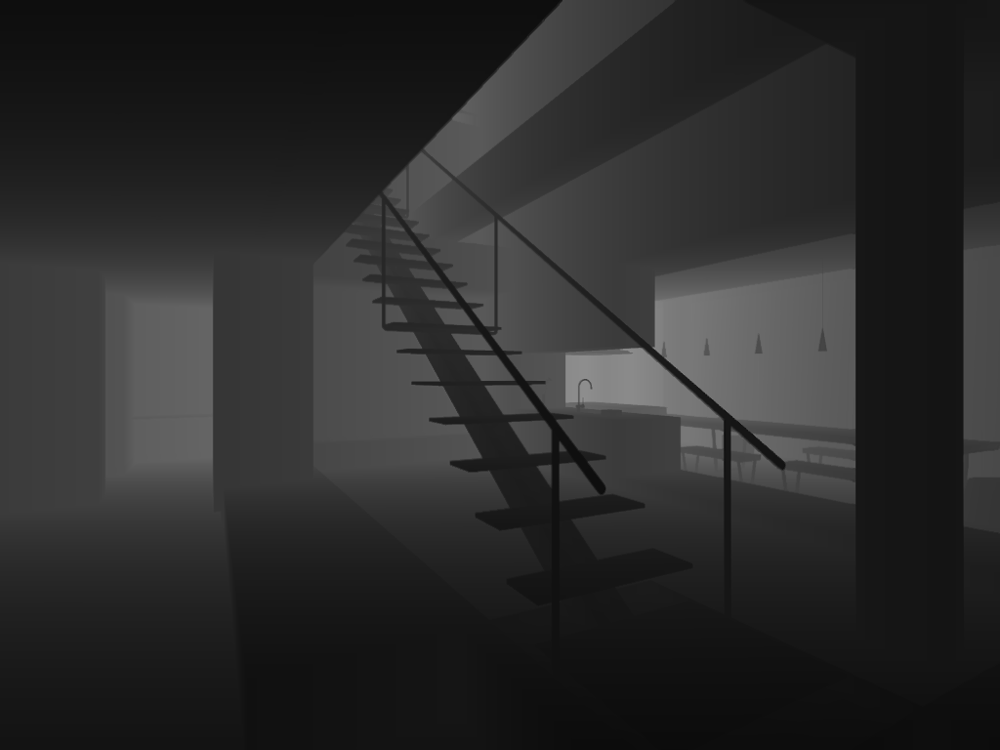
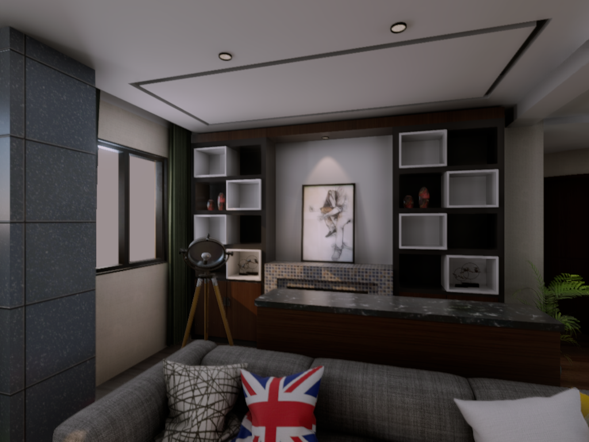
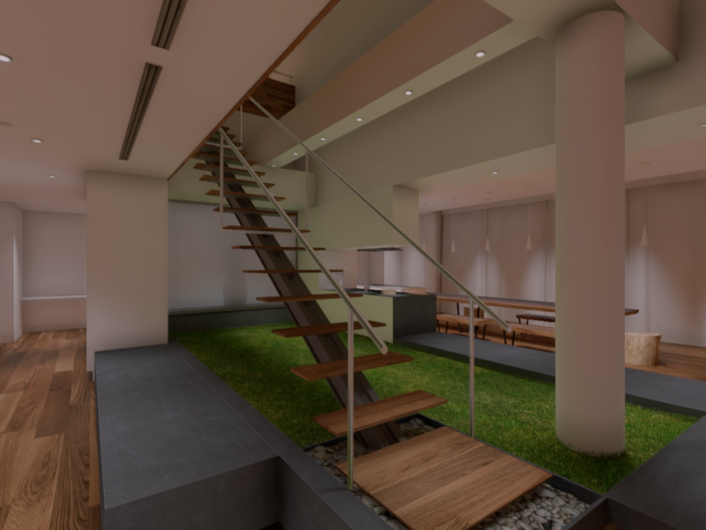
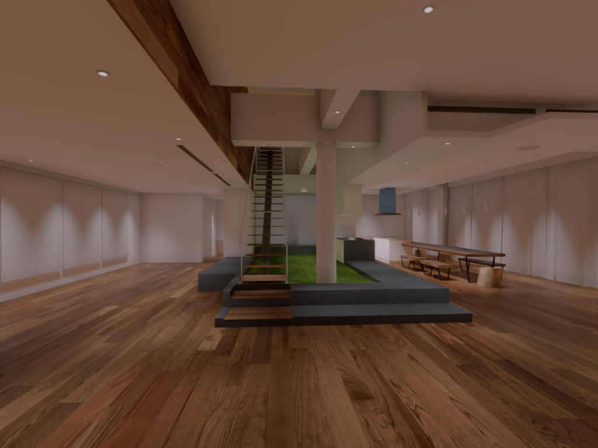

# FlightGoggles
A framework for photorealistic hardware-in-the-loop agile flight simulation using Unity3D and ROS.

[](https://www.youtube.com/watch?v=_VBww8YQuA8)

FlightGoggles was created by the [AgileDrones group](http://agiledrones.mit.edu) at the [MIT FAST Lab](http://karaman.mit.edu/group.html) and will be published in the proceedings of ICRA 2018.

## Quick Start Guide

### Prerequisites

For optimal performance, a GPU with `>=1.7GB` of VRAM is required. In our experience, a `2GB Nvidia Quadro M1000M` mobile workstation GPU is capable of rendering `~30FPS` of RGBD images. A desktop `12GB Nvidia Titan Xp` is capable of rendering `~120FPS` of RGB images and up to `180FPS` of grayscale images, depending on the complexity of the scene and render resolution.

GPUs with lower than `1.7GB` of VRAM [are usable](./REDUCING_VRAM_USAGE.md), but not officially supported.

### Download FlightGoggles Binary

* Download the appropriate FlightGoggles simulation environment binary from [the releases page](https://github.com/AgileDrones/FlightGoggles/releases). 
* Extract the binary and mark the file as executable (`chmod +x <flightGogglesBinary>`)

### Compile [FlightGoggles Client Bindings](https://github.com/AgileDrones/FlightGogglesClientBindings/)

```bash
# Install required libraries
sudo apt install libzmqpp-dev libeigen3-dev libopencv-dev
# Clone client bindings
git clone --recursive https://github.com/AgileDrones/FlightGogglesClientBindings.git
# Setup and build
cd FlightGogglesClientBindings
mkdir build
cd build
cmake ../ && make
```

### Running the FlightGoggles Simulation Environment

If both the FlightGoggles simulation and client are running on the same machine:

```bash
# Run FlightGoggles Client
cd FlightGogglesClientBindings/build/bin/
./GeneralClient
# Run FlightGoggles Simulation Environment
./<EXTRACTED_FLIGHTGOGGLES_BINARY>
```

However, if the FlightGoggles simulation and client are *NOT* running on the same machine:
```bash
# Run FlightGoggles Client
cd FlightGogglesClientBindings/build/bin/
./GeneralClient

# Run FlightGoggles Simulation Environment
./<EXTRACTED_FLIGHTGOGGLES_BINARY> -pose-host "tcp://<CLIENT_IP>:10253" -video-host "tcp://<CLIENT_IP>:10254"
```

After running either of these commands, you should see 2 OpenCV windows pop up with live feeds of RGBD data. Additionally, the FlightGoggles binary will open a debug render window with concatenated RGBD data.

|     RGB         |      Depth                |
|:---------------:|:-------------------------:|
|  |        |

### Available Environments

|     `Butterfly_World`   |      `Hazelwood_Loft_Full_Day`  | `NYC_Subway` |
|:-----------------------:|:---------------------------------:|:----------:|
|  |        |   |

| `Hazelwood_Loft_Full_Night` |    `Museum_Day`   |      `Museum_Day_Small`  | 
|:-------------------------:|:-----------------------:|:---------------------------------:|
|  |  |  | 

### Loading External Environments

FlightGoggles is able to load external scenes from [over 40 different filetypes](https://ricardoreis.net/?p=81) including `OBJ`, `DAE`, and `FBX`. Externally loaded scenes must have lighting embedded in their scene files to render correctly. To load an external scene that already has lighting, set the following settings in the FlightGoggles client:

```CPP
flightGoggles.state.sceneIsInternal = false;
flightGoggles.state.sceneFilename = "/PATH/TO/SCENE/FILE";
```

## Citation
If you find this work useful for your research, please cite:
```bibtex
@inproceedings{sayremccord2018visual,
  title={Visual-inertial navigation algorithm development using photorealistic camera simulation in the loop},
  author={Sayre-McCord, Thomas and
  Guerra, Winter and
  Antonini, Amado and
  Arneberg, Jasper and
  Brown, Austin and
  Cavalheiro, Guilherme and
  Fang, Yajun and
  Gorodetsky, Alex and
  McCoy, Dave and
  Quilter, Sebastian and
  Riether, Fabian and
  Tal, Ezra and
  Terzioglu, Yunus and
  Carlone, Luca and
  Karaman, Sertac},
  booktitle={2018 IEEE International Conference on Robotics and Automation (ICRA)},
  year={2018}
}
```
