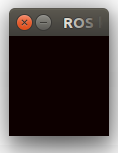

# FlightGoggles
A framework for photorealistic hardware-in-the-loop agile flight simulation using Unity3D and ROS.

[](https://youtu.be/e_3Yw0uPRKE)


## Quick Start Guide

### Prerequisites and testing setup

#### Hardware

We have tested this project on two different setups:
High end Desktop computer with:
- Processor: Intel i9 extreme (i9-7980XE)
- RAM: 32Gb
- GPU: Titan V

AWS instances:
- p3.2xlarge
- g3s.xlarge

For teleoperation, we use a Logitech Gamepad F310 or a keyboard. Other gamepads can work, but you must remap the buttons and pots in the universal_teleop configuration node. 

#### Software and Hardware Requirements

We use Ubuntu 16.04 and ROS Kinetic exclusively. Other versions are not officially supported.

For running the renderer in Ubuntu Linux, NVidia driver version `>=384.130` is required. GPUs and GPU driver versions from other manufacturers may work, but are not officially supported.

Prior to installing our software make sure to have ROS and Catkin tools installed:
http://wiki.ros.org/kinetic/Installation/Ubuntu
```bash
sudo apt install python-rosinstall python-rosinstall-generator python-wstool build-essential
sudo apt-get install python-catkin-tools
sudo apt install python-wstool
pip install catkin_pkg
```

### Install FlightGoggles Simulation Framework on Local Machine

```bash
# Setup catkin workspace
mkdir -p ~/catkin_ws/src
cd ~/catkin_ws/
catkin init
# Add workspace to bashrc.
echo 'source ~/catkin_ws/devel/setup.bash' >> ~/.bashrc
cd src
wstool init
# Install FlightGoggles nodes and deps from rosinstall file
wstool merge https://raw.githubusercontent.com/mit-fast/FlightGoggles/master/flightgoggles.rosinstall
wstool update
cd ../
# Install required libraries.
rosdep install --from-paths src --ignore-src --rosdistro kinetic -y
# Install external libraries for flightgoggles_ros_bridge
sudo apt install -y libzmqpp-dev libeigen3-dev
# Install dependencies for flightgoggles renderer
sudo apt install -y libvulkan1 mesa-vulkan-drivers vulkan-utils
# Build nodes
catkin build
# Refresh workspace
source ~/.bashrc
```

### Updating to latest version of FlightGoggles

The FlightGoggles renderer is still under active development. Thus, periodic updates are expected.
To update the FlightGoggles renderer to the latest version, please run the following commands:

```bash
# Pull new flightgoggles source code
cd ~/catkin_ws/src/flightgoggles
git pull
# Force flightgoggles to redownload binary at build time
catkin clean
catkin build
```

### Running the FlightGoggles Simulation Environment

```bash
# To run example environment with joystick/keyboard teleoperation
roslaunch flightgoggles teleopExample.launch
# To run core simulation framework without teleoperation
roslaunch flightgoggles core.launch
```

**NOTE:** The FlightGoggles beta might take up to 30 seconds to load. In the development build, asset loading to the GPU has not yet been optimized. If you'd like to keep the FlightGoggles render alive between tests to avoid waiting for the renderer to load, you can run the following:

```bash
# In terminal 1, leave the following running:
rosrun flightgoggles FlightGoggles.x86_64

# In terminal 2, you can run and exit various launch files with the use_external_renderer flag.
# To run example environment with joystick/keyboard teleoperation
roslaunch flightgoggles teleopExample.launch use_external_renderer:=1
# To run core simulation framework without teleoperation
roslaunch flightgoggles core.launch use_external_renderer:=1
```

Users may also run any of three different challenges by running:
```
roslaunch flightgoggles reporter.launch level:=easy
roslaunch flightgoggles reporter.launch level:=medium
roslaunch flightgoggles reporter.launch level:=hard
```
The challenges are completed if the drone passes through each of the gates that are part of the challenge in order.

These launch files run a reporter node in addition to the rest of the software that reports when the drone crosses the challenge gates and the overall time it took.

Feel free to edit the yaml files on `flightgoggles/config/challenges` to setup your own challenges


### Default Controls 

For human teleoperation, a Logitech F310 controller or normal QWERTY keyboard can be used. Any of the two methods can 
be used using the following roslaunch command:
```bash
roslaunch flightgoggles teleopExample.launch
```

To use a keyboard for teleoperation, the keyboard controller window (see figure below) must be focused. 
`spacebar` must be held to enable keyboard control. Similar to Mode 2 RC Controllers, left hand `ASDW` keys control thrust
and yaw rate. The right hand `JKLI` keys control roll and pitch rate. 



For joystick control, the joystick mode switch should be in mode `D`. To enabled joystick control, `LT` should be held.
Similar to Mode 2 RC Controllers, the left hand joystick controls thrust
and yaw rate. The right hand joystick controls roll and pitch rate. 

**Note:** Collisions reset the simulator to its initial condition. There is a timeout after resetting, for example to make sure that any running algorithms are aware of the reset. The timeout is set to 0.1 seconds by default, but can be changed in `src/FlightGoggles/flightgoggles/config/drone/drone.yaml` where the parameter is listed as `reset_timeout`. A manual reset can be invoked by publishing an empty message `std_msgs/Empty` to the ropic `/uav/collision`.

To fly around without colliders enabled for the purpose of exploring the environment, colliders can be disabled by setting `ignore_collisions` to true in the launch file or passing it as an argument to the launch file without editing the launch file. E.g.`roslaunch flightgoggles teleopExample.launch ignore_collisions:=1`

### Running Flightgoggles in AWS (or other headless Linux servers)

These instructions are derived from [here](https://towardsdatascience.com/how-to-run-unity-on-amazon-cloud-or-without-monitor-3c10ce022639)

Start by spinning up an EC2 instance. We recommend the following configuration:

Instance: `p3.2xlarge` or `g3s.xlarge`. `p3.2xlarge` is preferred, but `g3s.xlarge` is usable (has lower framerate).
Amazon Base Image: `ami-0826e0d47dd8eebf6 ( `https://aws.amazon.com/marketplace/pp/B077GCZ4GR`)

Now we need to set up a virtual display. Install Xorg:

```bash
sudo apt-get install xserver-xorg-core
```

Figure out the BusID of the GPU:

```bash
nvidia-xconfig --query-gpu-info
```

On a g3s.xlarge, the result is `PCI:0:30:0`

Now we need to configure Xorg. Run this command (replace the BusID, if appropriate):

```bash
sudo nvidia-xconfig -a --allow-empty-initial-configuration --virtual=3200x1800 --busid PCI:0:30:0
```

Read the output. If it says that it wrote the file `XF86Config`, we need to rename it manually:

```bash
sudo mv /etc/X11/XF86Config /etc/X11/xorg.conf
```

Now reboot. Once restarted, run the following commands:

```bash
export DISPLAY=:0
sudo X :0 &
```

These commands need to be run after every reboot.

To test that graphical applications run now, try to run `glxgears`. If the output looks something like `??? frames in 5.0 seconds = ??? FPS`, then it's working. Follow the install instructions above to get flightgoggles running.

If you would like to see the output of the simulation locally, you will need to set the `ROS_MASTER_URI` and `ROS_IP` environment variables appropriately on your EC2 instance and on your local machine (see code below). Note that each EC2 instance will have 2 ip addresses - set `ROS_IP` to the external IP address. Also be sure to open up inbound and outbound ports on the EC2 instance through the web portal.

On AWS:
```bash
export ROS_MASTER_URI=http://ec2_public_ip:11311
export ROS_IP=ec2_public_ip
roslaunch flightgoggles core.launch
```

On your local machine:
```bash
export ROS_MASTER_URI=http://ec2_public_ip:11311
export ROS_IP=local_machine_public_ip
roslaunch flightgoggles teleopAWSFromLocalMachine.launch # Requires that FlightGoggles is also installed locally
```

Assuming that you have FlightGoggles installed on AWS and on your local machine, you should be able to see the output of flightgoggles on your local machine via rviz.

## FAQ
**Q. What is the co-ordinate system of the drone?**  
The simulated drone uses a X-Forward, Y-Left and Z-Up or NWU system of reference. 

**Q. Is the camera calibration available?**
The camera calibration is published under `/uav/camera/left/camera_info`. 

**Q. Is there support for 18.04 LTS and ROS Melodic?**  
Since all of our testing involved Ubuntu 16.04 and ROS Kinetic, we do not officially support using Ubuntu 18.04 and ROS Melodic but users have been [able to use FG with ROS Melodic and Ubuntu 18.04](https://github.com/mit-fast/FlightGoggles/issues/30)

**Q. What are the minimum requirements to run FlightGoggles locally?**  
At the moment, FlightGoggles requires ~`3.4GB` of VRAM and has the same underlying requirements as the [Vulkan rendering API]( https://en.wikipedia.org/wiki/Vulkan_(API) ). 

**Q. I am having trouble receiving images from FG while using AWS.**   
Your computer is likely assigned a local IP address behind a NAT. Please follow the instructions from [here](https://answers.ros.org/question/11045/how-to-set-up-vpn-between-ros-machines/) to setup VPN. 

**Q. Why does the simulator run very slow with `use_sim_time` parameter set to `true`?**  
FlightGoggles is similar to the Gazebo simulator in that it can scale the ROS clock down if the simulation is running slowly. Thus, your autonomous algorithms will see a constant 60Hz camera in `sim time` and should experience accurate drone dynamics as long as the camera renderer is able to run ([see ROS clock documentation](http://wiki.ros.org/Clock)).   

**Q. Does FlightGoggles currently support Stereo?**  
Yes! Simply pass `render_stereo:=true` to the FlightGoggles launch file. **Note:** as of `v2.0.2` the combined vertical resolution of the two stereo cameras must not be greater than the vertical resolution of the largest monitor attached to your computer. In other words, you must have a monitor with `>=1536` vertical resolution to render stereo at the default camera resolution. A current workaround is to [decrease the default camera resolution](https://github.com/mit-fast/FlightGoggles/blob/master/flightgoggles_ros_bridge/src/Common/jsonMessageSpec.hpp#L65), attach a high resolution "dummy" monitor, or rotate or attach a vertical display to your rendering computer. 

As an explanation for the current restriction, FlightGoggles uses the GPU backbuffer for storing rendered images. However, the size of this buffer is limited by the screen resolution. Thus, concatenated images cannot be larger than the size of the GPU backbuffer. This issue will be patched in a later release.

**Q. Is there an easy way to reset the simulation to its intial state without having to restart FlightGoggles?**

Yes, you can reset the dynamics by publishing an empty message `std_msgs/Empty` to the ropic `/uav/collision`. E.g. from a terminal using the command:
`rostopic pub /uav/collision std_msgs/Empty`
Note that there is a timeout after each reset, during which the drone cannot go to armed state (similar to when the simulation is initialized and no thrust commands have been given yet). The timeout is set to 0.1 seconds by default, but you can change this in `src/FlightGoggles/flightgoggles/config/drone/drone.yaml` where the parameter is listed as `reset_timeout`.

**Q. FlightGoggles crashes on startup or on scene load.**

So far, we have seen 2 reasons for crashes on startup: 
1. Insufficient VRAM (< 2.1GB).
    - Solved by upgrading GPU or switching to AWS rendering.
2. Vulkan renderer choosing wrong GPU.
    - Diagnosable by checking line in player.log similar to `Vulkan renderer=[GeForce GTX 750 Ti] id=[1380].` 
    - If the listed GPU is not your desired GPU, set the environment variable `VK_ICD_FILENAMES` to `/usr/share/vulkan/icd.d/nvidia_icd.json` as described [here](https://wiki.archlinux.org/index.php/Vulkan). See issue [#28](https://github.com/mit-fast/FlightGoggles/issues/28) for more detail.

## Citation
If you find this work useful for your research, please cite:
```bibtex
@inproceedings{sayremccord2018visual,
  title={Visual-inertial navigation algorithm development using photorealistic camera simulation in the loop},
  author={Sayre-McCord, Thomas and
  Guerra, Winter and
  Antonini, Amado and
  Arneberg, Jasper and
  Brown, Austin and
  Cavalheiro, Guilherme and
  Fang, Yajun and
  Gorodetsky, Alex and
  McCoy, Dave and
  Quilter, Sebastian and
  Riether, Fabian and
  Tal, Ezra and
  Terzioglu, Yunus and
  Carlone, Luca and
  Karaman, Sertac},
  booktitle={2018 IEEE International Conference on Robotics and Automation (ICRA)},
  year={2018}
}
```
## Papers using this work
```bibtex
@inproceedings{antonini2018blackbird,
  title={The Blackbird Dataset: A large-scale dataset for UAV perception in aggressive flight},
  author={Antonini, Amado and Guerra, Winter and Murali, Varun and Sayre-McCord, Thomas and Karaman, Sertac},
  booktitle={International Symposium on Experimental Robotics, {ISER} 2018, Buenos Aires,
               Argentina, November 5-8, 2018.},
  year={2018}
}
```
Blackbird Dataset: [Paper](https://arxiv.org/abs/1810.01987) [Website](https://github.com/mit-fast/Blackbird-Dataset)

## Core Contributers

```
Winter Guerra
Ezra Tal
Varun Murali
Sebastian Quilter
John Aleman
Sertac Karaman
```
