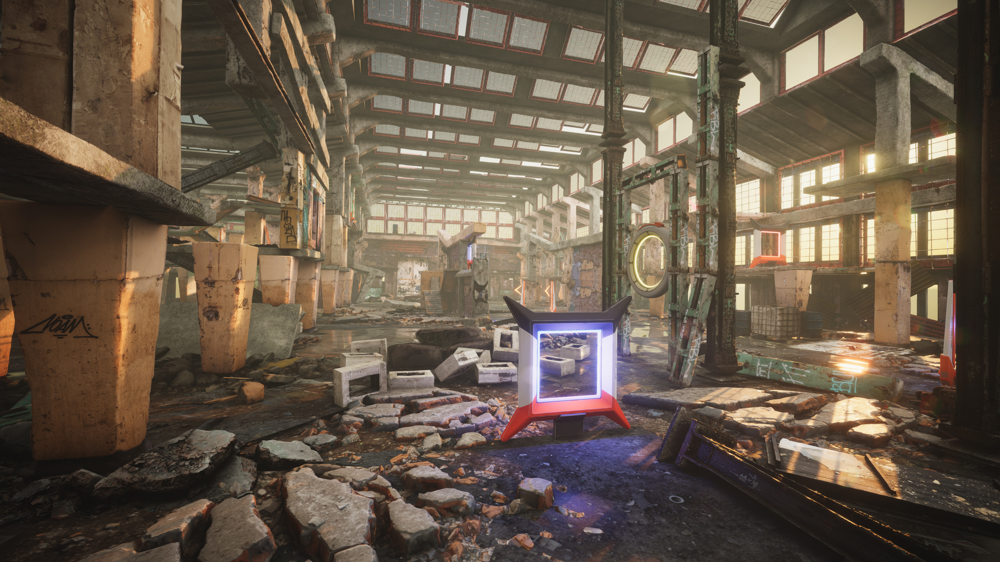
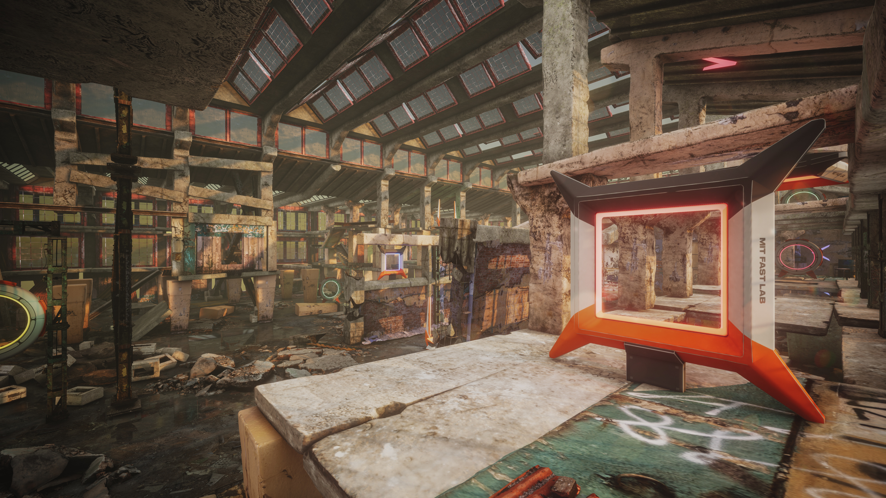

# FlightGoggles

## Documentation, Installation, & Usage Instructions
Please refer to the [wiki-page](https://github.com/mit-fast/FlightGoggles/wiki) for code documentation, installation, usage instructions. An [FAQ](https://github.com/mit-fast/FlightGoggles/wiki/FAQ) is also available there.

## Description

A framework for photorealistic hardware-in-the-loop agile flight simulation using Unity3D and ROS.

[](https://youtu.be/e_3Yw0uPRKE)




## Citation
If you find this work useful for your research, please cite:
```bibtex
@inproceedings{sayremccord2018visual,
  title={Visual-inertial navigation algorithm development using photorealistic camera simulation in the loop},
  author={Sayre-McCord, Thomas and
  Guerra, Winter and
  Antonini, Amado and
  Arneberg, Jasper and
  Brown, Austin and
  Cavalheiro, Guilherme and
  Fang, Yajun and
  Gorodetsky, Alex and
  McCoy, Dave and
  Quilter, Sebastian and
  Riether, Fabian and
  Tal, Ezra and
  Terzioglu, Yunus and
  Carlone, Luca and
  Karaman, Sertac},
  booktitle={2018 IEEE International Conference on Robotics and Automation (ICRA)},
  year={2018}
}
```
## Papers using this work
```bibtex
@inproceedings{antonini2018blackbird,
  title={The Blackbird Dataset: A large-scale dataset for UAV perception in aggressive flight},
  author={Antonini, Amado and Guerra, Winter and Murali, Varun and Sayre-McCord, Thomas and Karaman, Sertac},
  booktitle={International Symposium on Experimental Robotics, {ISER} 2018, Buenos Aires,
               Argentina, November 5-8, 2018.},
  year={2018}
}
```
Blackbird Dataset: [Paper](https://arxiv.org/abs/1810.01987) [Website](https://github.com/mit-fast/Blackbird-Dataset)

## Core Contributers

```
Winter Guerra
Ezra Tal
Varun Murali
Sebastian Quilter
John Aleman
Sertac Karaman
```
